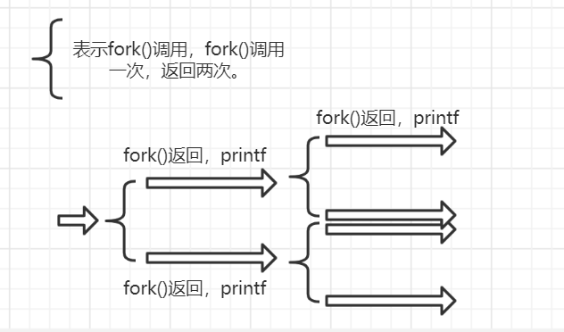

Questions

1. Writeaprogramthatcalls fork(). Beforecalling fork(), havethe main process access a variable (e.g., x) and set its value to something (e.g., 100). What value is the variable in the child process? Whathappenstothevariablewhenboththechildandparentchange the value of x?

   ```c
   #include <unistd.h>
   #include <stdio.h>
   #include <sys/types.h>
   
   int main() {
       int x = 100;
       if (fork() == 0) {
           pid_t pid = getpid();
           printf("child %u: %u\n", pid, x); // 100
           x = 20; // copy on write.
           printf("child %u: %u\n", pid, x); // 20
       } else {
           pid_t pid = getpid();
           printf("parent %u: %u\n", pid, x); // 100
           x = 50; // cow.
           printf("parent %u: %u\n", pid, x); // 50
       }
   }
   ```

2. Write a program that opens a file (with the open() system call) and then calls fork() to create a new process. Can both the child and parent access the file descriptor returned by open()? What happens when they are writing to the file concurrently, i.e., at the same time?

   ```c
   #include <unistd.h>
   #include <stdio.h>
   #include <fcntl.h>
   #include <sys/types.h>
   #include <errno.h>
   #include <stdlib.h>
   #include <sys/wait.h>
   
   int main() {
       int fd = open("./tmp", O_CREAT|O_WRONLY, S_IRUSR|S_IWUSR);
       if (fd < 0) {
           perror(NULL);
           exit(EXIT_FAILURE);
       }
       if (fork() == 0) {
           for (int i=0; i<500; i++)
               if (write(fd, "child\n", 6) < 0) {
                   perror(NULL);
                   exit(EXIT_FAILURE);
               }
       } else {
           for (int i=0; i<500; i++)
               if (write(fd, "parent\n", 7) < 0) {
                   perror(NULL);
                   exit(EXIT_FAILURE);
               }
           wait(NULL);
           close(fd);
       }
   }
   // 交叉写入，顺序是不确定的，但其中一个进程一次write是原子的，不会出现"parchild\nent"这样的情况。
   ```

3. Write another program using fork(). The child process should print “hello”; the parent process should print “goodbye”. You should try to ensure that the child process always prints first; can you do this without calling wait() in the parent?

   ```c
   #include <unistd.h>
   #include <stdio.h>
   
   int main() {
       if (fork() == 0) {
           printf("hello\n");
       } else {
           // wait(NULL);
           sleep(2); // 如果是父进程先被调度执行，那就让父进程被挂起/阻塞2秒，从而让子进程先执行。
           printf("goodbye\n");
       }
   }
   ```

4. Write a program that calls fork() and then calls some form of exec() to run the program /bin/ls. See if you can try all of the variants of exec(), including (on Linux) execl(), execle(), execlp(), execv(), execvp(), and execvpe(). Why do you think there are so many variants of the same basic call?

   ```c
   #include <unistd.h>
   #include <stdio.h>
   #include <sys/wait.h>
   #include <stdlib.h>
   #include <error.h>
   
   // int execl(const char *path, const char *arg, ...
   //                 /* (char  *) NULL */);
   // int execlp(const char *file, const char *arg, ...
   //                 /* (char  *) NULL */);
   // int execle(const char *path, const char *arg, ...
   //                 /*, (char *) NULL, char * const envp[] */);
   // int execv(const char *path, char *const argv[]);
   // int execvp(const char *file, char *const argv[]);
   // int execvpe(const char *file, char *const argv[],
   //                 char *const envp[]);
   
   int main() {
       if (fork() == 0) {
           // 对于最简单的execl第一个参数必须使用完整的绝对或相对路径，
           // 带p的exec会在PATH环境变量中逐个路径寻找指定的可执行文件，
           // 如果第一个参数没有包含斜杆/的话（意味着第一个参数只给出了可执行文件名）。
           if (execl("/bin/ls", "ls", "-l", NULL) < 0) {
               perror(NULL);
               exit(EXIT_FAILURE);
           }
       } else {
           wait(NULL);
       }
   }
   ```

5. Now write a program that uses wait() to wait for the child process to finish in the parent. What does wait() return? What happens if you use wait() in the child?

   ```c
   #include <unistd.h>
   #include <stdio.h>
   #include <sys/wait.h>
   #include <stdlib.h>
   #include <error.h>
   
   int main() {
       if (fork() == 0) {
           if (wait(NULL) < 0) {
               perror(NULL); // No child processes
               exit(EXIT_FAILURE);
           }
       } else {
           wait(NULL);
       }
   }
   
   // man wait
   // All of these system calls (wait, waitpid) are used to wait for state changes in a child of the calling process, and obtain information about the child whose state has changed.  A state change is considered to be: the child terminated; the child was stopped by a signal; or the child was resumed by a signal.  In the case of a terminated child, performing a wait allows the system to release the resources associated with the child; if a wait is not performed, then the terminated child remains in a "zombie" state (see NOTES below).
   // NOTES
   // A child that terminates, but has not been waited for becomes a "zombie".  The kernel maintains a minimal set of information about the zombie process (PID,  termination  status, resource  usage information) in order to allow the parent to later perform a wait to obtain information about the child.  As long as a zombie is not removed from the system via a wait, it will consume a slot in the kernel process table, and if this table fills, it will not be possible to create further processes.  If a parent process terminates,  then its  "zombie"  children  (if  any)  are adopted by init(1), (or by the nearest "subreaper" process as defined through the use of the prctl(2) PR_SET_CHILD_SUBREAPER operation); init(1) automatically performs a wait to remove the zombies.
   ```

   **注意，如果某个主进程还没运行结束，OS就不能主动释放该主进程的zombie进程，因为该主进程可能需要从其zombie子进程中获取某些信息，所以一旦一个主进程不需要获取zombie子进程的信息，却又忘了wait其子进程，且制造了大量的zombie子进程，那么系统很快可能资源被消耗殆尽**。一个例子是多进程服务器。

   wait的手册中有一个不错的例子：

   ```c
   #include <sys/wait.h>
   #include <stdlib.h>
   #include <unistd.h>
   #include <stdio.h>
   
   int main(int argc, char *argv[]) {
       pid_t cpid, w;
       int wstatus;
   
       cpid = fork();
       if (cpid == -1) {
           perror("fork");
           exit(EXIT_FAILURE);
       }
   
   	if (cpid == 0) {            /* Code executed by child */
           printf("Child PID is %ld\n", (long) getpid());
           if (argc == 1)
               // pause() causes the calling process (or thread) to sleep until a signal is delivered that either terminates the process or causes the invocation of a signal-catching function.
               pause();                    /* Wait for signals */
           _exit(atoi(argv[1]));
   
       } else {                    /* Code executed by parent */
           do {
               w = waitpid(cpid, &wstatus, WUNTRACED | WCONTINUED);
               if (w == -1) {
                   perror("waitpid");
                   exit(EXIT_FAILURE);
               }
   
               if (WIFEXITED(wstatus)) {
                   printf("exited, status=%d\n", WEXITSTATUS(wstatus));
               } else if (WIFSIGNALED(wstatus)) {
                   printf("killed by signal %d\n", WTERMSIG(wstatus));
               } else if (WIFSTOPPED(wstatus)) {
                   printf("stopped by signal %d\n", WSTOPSIG(wstatus));
               } else if (WIFCONTINUED(wstatus)) {
                   printf("continued\n");
               }
           } while (!WIFEXITED(wstatus) && !WIFSIGNALED(wstatus));
           exit(EXIT_SUCCESS);
       }
   }
   
   // $ ./a.out &
   // Child PID is 32360
   // [1] 32359
   // $ kill -STOP 32360
   // stopped by signal 19
   // $ kill -CONT 32360
   // continued
   // $ kill -TERM 32360
   // killed by signal 15
   // [1]+  Done                    ./a.out
   ```

6. Write a slight modification of the previous program, this time using waitpid() instead of wait(). When would waitpid() be useful?

   主要看waitpid的手册，**简单说就是waitpid提供了更多的选项和行为，使用起来更灵活**，比如可以监听子进程的子集的状态变化、调用时子进程的状态都没变化时是否马上返回、父进程可以更多地获知子进程的状态变化（比如指定WUNTRACED选项，子进程被stop时会返回，这样父进程就知道子进程此时被stop了，类似的WCONTINUED选项在一个stopped子进程恢复执行时返回，如果是wait，父进程只知道子进程是否运行完或被终止）等。

7. Write a program that creates a child process, and then in the child closes standard output (STDOUT FILENO). What happens if the child calls printf() to print some output after closing the descriptor?

   ```c
   #include <unistd.h>
   #include <stdio.h>
   #include <sys/wait.h>
   #include <stdlib.h>
   #include <error.h>
   #include <errno.h>
   
   int main() {
       if (fork() == 0) {
           close(STDOUT_FILENO);
           errno = 0;
           printf("x");
           fprintf(stderr, "y\n");
           perror(NULL);
           exit(EXIT_FAILURE);
           // y
           // Bad file descriptor
       } else {
           wait(NULL);
       }
   }
   ```

8. Write a program that creates two children, and connects the standard output of one to the standard input of the other, using the pipe() system call.

   ```c
   #include <unistd.h>
   #include <stdio.h>
   #include <sys/wait.h>
   
   int main() {
       int pipefd[2];
       pipe(pipefd);
       if (fork() == 0) {
           // writer.
           close(STDOUT_FILENO);
           // The dup() system call creates a copy of the file descriptor oldfd, using the lowest-numbered unused file descriptor for the new descriptor.
           dup(pipefd[1]);
           // 记得在3后面写上一个非数字字符，否则scanf无法确定是否读取完了一个数字，
           // 读取3后会再次调用read从管道中读，此时就会永久阻塞。
           // （并不是因为这里没有刷新缓冲区，把\n换成i等非数字字符效果是一样的）
           printf("2 + 3\n");
       } else {
           wait(NULL);
           if (fork() == 0) {
               // reader.
               close(STDIN_FILENO);
               dup(pipefd[0]);
               int a, b;
               scanf("%d + %d", &a, &b);
               printf("%d + %d = %d\n", a, b, a+b);
           } else {
               wait(NULL);
           }
       }
   }
   ```


```c
#include <unistd.h>
#include <stdio.h>

int main(int argc, char *argv[]) {
    for (int i=0; i<2; i++) {
        fork();
        printf("-\n");
    }
}
```



因此，像这种程序，若fork() n次，那么会打印`2^n-1-1`次。（比如上图中的二叉树有三层，总共2^3-1个结点，去掉根没有打印，再减一）