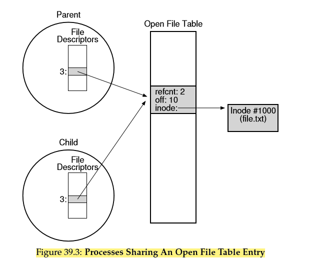

xv6关于文件系统的相关数据结构：

```c
struct proc {
    ...
    struct file *ofile[NOFILE]; // Open files. 下标也就文件描述符了。
    ...
};

struct {
    struct spinlock lock;
    struct file file[NFILE];
} ftable;

struct file {
    int ref;
    char readable;
    char writable;
    struct inode *ip;
    uint off;
};
```



子进程的ofile数组一开始是父进程的一份拷贝，对应的文件描述符指向同一个File对象，也就是父子进程共享同一个offset，所以父子进程对同一个文件的读写可以被彼此看到。

A file is an array of bytes which can be created, read, written, and deleted. It has a low-level name (i.e., a number) that refers to it uniquely. The low-level name is often called an i-number.

A directory is a collection of tuples, each of which contains a human-readable name and low-level name to which it maps.

Each file descriptor is a private, per-process entity, which refers to an entry in the open file table. The entry therein tracks which file this access refers to, the current offset of the file (i.e., which part of the file the next read or write will access), and other relevant information.

To have multiple human-readable names in the file system refer to the same underlying file, use hard links or symbolic links. Each is useful in different circumstances, so consider their strengths and weaknesses before usage. And remember, deleting a file is just performing that one last unlink() of it from the directory hierarchy.